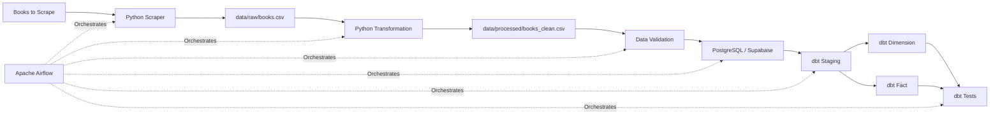

# Books Data Engineering Pipeline

An end-to-end data engineering pipeline that collects book data through web scraping, transforms and validates the data, loads it into PostgreSQL, and orchestrates the workflow using Apache Airflow and dbt.

## Project Overview

This project demonstrates a complete data pipeline starting from an external web source and ending in an analytics-ready PostgreSQL database.

The pipeline is designed to demonstrate practical data engineering concepts including:

* Web scraping and crawling
* Data extraction and transformation
* Data quality validation
* PostgreSQL data loading
* Idempotent data loading
* Airflow workflow orchestration
* dbt data transformation and testing
* Dockerized data engineering environment
* Separation between raw, processed, and analytical data layers

The source used for this project is [Books to Scrape](https://books.toscrape.com/), a website specifically designed for web scraping practice.

---

## Architecture



### Pipeline Flow

The complete workflow is orchestrated by Apache Airflow:

```text
Scrape
   ↓
Transform
   ↓
Validate
   ↓
Load
   ↓
dbt Run
   ↓
dbt Test
```

Each stage has a specific responsibility.

### 1. Extraction

Python requests data from Books to Scrape and BeautifulSoup parses the HTML pages.

The scraper extracts:

* Product name
* Price
* Rating
* Stock quantity
* Product URL
* Scraping timestamp

The raw result is stored as:

```text
data/raw/books.csv
```

---

### 2. Transformation

The transformation layer cleans and standardizes the extracted data.

Examples:

* Convert price from string to numeric
* Convert rating from text to integer
* Convert stock quantity to integer
* Remove duplicate products
* Remove invalid records

The transformed data is stored as:

```text
data/processed/books_clean.csv
```

---

### 3. Data Validation

Before loading the data into PostgreSQL, validation checks are performed.

The validation layer checks:

* Required columns
* Missing values
* Duplicate product URLs
* Valid price values
* Rating range
* Valid stock quantity

Invalid data causes the pipeline task to fail instead of continuing to the database loading stage.

---

### 4. Data Loading

The cleaned data is loaded into PostgreSQL.

The main table is:

```text
books
```

The table contains:

| Column           | Description               |
| ---------------- | ------------------------- |
| `book_id`        | Primary key               |
| `product_name`   | Book title                |
| `price`          | Book price                |
| `rating`         | Rating from 1–5           |
| `stock_quantity` | Available stock           |
| `product_url`    | Unique product URL        |
| `scraped_at`     | Scraping timestamp        |
| `created_at`     | Record creation timestamp |

The loader uses an upsert strategy based on `product_url`, allowing the pipeline to be safely rerun without creating duplicate products.

---

## dbt Transformation Layer

After the data is loaded into PostgreSQL, dbt creates the analytical models.

### Staging

```text
stg_books
```

The staging model provides a clean interface to the source table.

### Dimension

```text
dim_book
```

Contains descriptive information about each book:

* `book_id`
* `product_name`
* `product_url`

### Fact

```text
fact_book_inventory
```

Contains measurable book/inventory information:

* `book_id`
* `price`
* `rating`
* `stock_quantity`
* `scraped_at`

The distinction follows a simple analytical modeling principle:

```text
Dimension → descriptive context

Fact → measurable events / values
```

---

## Data Quality with dbt

dbt tests are used to verify the analytical models.

Current tests include:

* `not_null`
* `unique`

For example, `book_id` in `stg_books` must be:

```text
NOT NULL
UNIQUE
```

The pipeline executes:

```bash
dbt run
dbt test
```

after the PostgreSQL loading stage.

---

## Airflow Orchestration

Apache Airflow manages the dependency between each pipeline stage.

The current DAG is:

```text
scrape_books
      ↓
transform_books
      ↓
validate_books
      ↓
load_books
      ↓
dbt_run
      ↓
dbt_test
```

Airflow is responsible for:

* Task orchestration
* Dependency management
* Pipeline monitoring
* Task failure handling
* Scheduling

The actual data processing logic remains inside the Python and dbt projects.

---

## Technology Stack

| Technology     | Purpose                                     |
| -------------- | ------------------------------------------- |
| Python         | Data extraction, transformation, validation |
| Requests       | HTTP requests                               |
| BeautifulSoup  | HTML parsing                                |
| Pandas         | Data transformation                         |
| PostgreSQL     | Relational database                         |
| Supabase       | Hosted PostgreSQL                           |
| Apache Airflow | Pipeline orchestration                      |
| dbt            | Analytical transformation and testing       |
| Docker         | Containerized Airflow environment           |
| Git            | Version control                             |

---

## Project Structure

```text
scrap-data-engineering/
│
├── data/
│   ├── raw/
│   │   └── books.csv
│   │
│   └── processed/
│       └── books_clean.csv
│
├── src/
│   ├── scraper/
│   │   ├── test_request.py
│   │   ├── test_detail.py
│   │   └── scrape_books.py
│   │
│   ├── transformation/
│   │   ├── inspect_books.py
│   │   └── transform_books.py
│   │
│   ├── validation/
│   │   └── validate_books.py
│   │
│   └── loader/
│       ├── test_connection.py
│       └── load_books.py
│
├── dags/
│   └── books_pipeline.py
│
├── dbt_books/
│   ├── models/
│   │   ├── staging/
│   │   │   └── stg_books.sql
│   │   │
│   │   ├── dimensions/
│   │   │   └── dim_book.sql
│   │   │
│   │   └── facts/
│   │       └── fact_book_inventory.sql
│   │
│   ├── dbt_project.yml
│   ├── Dockerfile
│   └── README.md
│
├── .env
├── .gitignore
├── docker-compose.yml
└── README.md
```

---

## Running the Pipeline

### 1. Create Python environment

```bash
python -m venv .venv
```

Activate the environment:

**Windows PowerShell**

```powershell
.venv\Scripts\Activate.ps1
```

Install dependencies:

```bash
pip install -r requirements.txt
```

---

### 2. Configure environment variables

Create a `.env` file:

```env
DB_HOST=your-host
DB_PORT=5432
DB_NAME=postgres
DB_USER=your-user
DB_PASSWORD=your-password
```

Credentials should not be committed to Git.

---

### 3. Run the pipeline manually

Scrape:

```bash
python src/scraper/scrape_books.py
```

Transform:

```bash
python src/transformation/transform_books.py
```

Validate:

```bash
python src/validation/validate_books.py
```

Load:

```bash
python src/loader/load_books.py
```

Run dbt:

```bash
cd dbt_books
dbt run
dbt test
```

---

### 4. Run with Airflow

Start the Docker environment:

```bash
docker compose up -d
```

Airflow is available at:

```text
http://localhost:8080
```

Trigger the `books_pipeline` DAG from the Airflow interface.

---

## Data Engineering Concepts Demonstrated

This project demonstrates the following concepts:

### ETL

```text
Extract → Transform → Load
```

### Workflow Orchestration

Airflow manages the execution order and dependencies between pipeline tasks.

### Data Quality

Validation is performed before loading, while dbt tests verify the analytical models after transformation.

### Idempotency

The PostgreSQL loader uses an upsert strategy based on the unique product URL, allowing repeated pipeline executions without creating duplicate records.

### Data Modeling

dbt separates the analytical layer into staging, dimension, and fact models.

### Containerization

Airflow and dbt are executed in a Docker-based environment to provide a reproducible setup.

